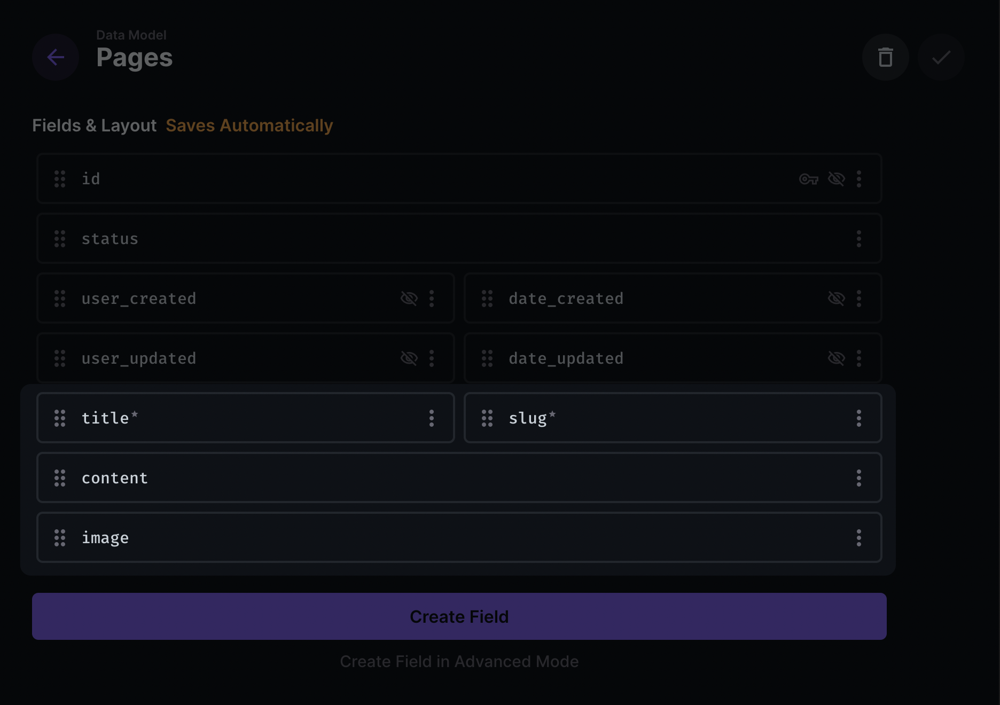
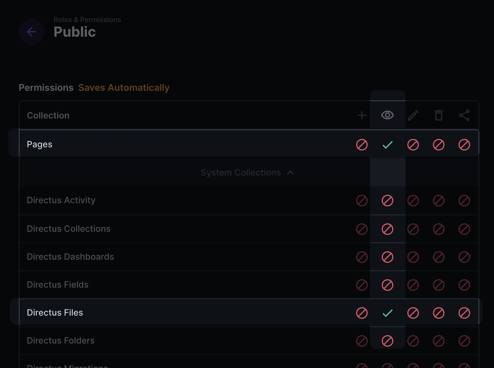

# Nuxt 3 / Directus Starter

Opinionated starter template for Nuxt 3 using Directus 9 as a backend. Develop internal or client applications faster with this batteries-included starter.

**[View The Demo Site](https://directus-nuxt3-starter.netlify.app/)**

**Features**

- Built-in Directus 9 support to use as your backend, API, headless CMS - whatever your use case
- Tailwind CSS with all plugins, HeadlessUI, and Heroicons (Now Using V2) icon support
- Authentication and user store already configured for you
- Ready to use common components like modals, dropdowns, and file upload input
- Common utilities like relative time and currency formatting so you don't need to include yet another package
- ESLint and Prettier already configured
- Dark mode support

## Stack

### Nuxt 3

The leading Vue framework that handles routing, server side rendering, and more.

Be sure to keep your eye on [their roadmap](https://nuxt.com/docs/community/roadmap) for the latest information.

---

### Directus 9 support via the Directus SDK

If you're not familiar - Directus is an open data platform backed by a SQL database that allows you to quickly created a ready-to-use backend / API to power your application without writing any code.

For a smooth experience, the [Directus SDK](https://docs.directus.io/reference/sdk/#javascript-sdk) is already integrated for you and availably globally as a Nuxt plugin.

```vue
<script setup>
// Get the $directus plugin from Nuxt App composable
const { $directus } = useNuxtApp()

// Fetch content from Directus
const { data } = await $directus.items('your_collection_name').readByQuery({
      filter: {
        status: { _eq: 'published' },
      },
      limit: 5,
    })
</script>
```

There is also an included composable for getting the asset urls for your Directus files. Nuxt 3 auto-imports all your composables within the `/composables` directory so calling this helper is super simple.

```vue
<template>

</template>
<script setup>
const { fileUrl } = useFiles()

const file = {
	id: 'lkerwfdafaddfgglk3242'
}
</script>
```

There are ready to go examples for:

- Authentication
- Fetching content from your Directus instance
- Protecting content with Nuxt Middleware
- Uploading files

---

### Tailwind CSS

#### Primary Color

All the base components included in the starter use a `primary` class like `class="text-primary-600 bg-primary-500"` for colors to make it simple to change your preferred base color.

Just adjust it within your `tailwind.config.js`

```vue
// tailwind.config.js
...
theme: {
    extend: {
      colors: {
        primary: colors.violet, // Change this to your preferred Tailwind shade ie colors.yourShade
        gray: colors.slate,
      },
    },
  },
...
```

#### Dark Mode

Dark mode is already enabled in the `tailwind.config.js` and all the base components included have full support.

Dark mode toggling is provided by [VueUse `useDark` composable](https://vueuse.org/core/usedark/#usedark). And there is an example toggle component you can use.

If you don't wish to use dark mode, you can simply remove the composable and the `dark:` classes from the components.

#### Tailwind Plugins

All the official Tailwind Plugins are installed and ready to use as well.

- [Typography](https://tailwindcss.com/docs/typography-plugin)
- [Forms](https://tailwindcss.com/docs/plugins#forms)
- [Aspect Ratio](https://github.com/tailwindlabs/tailwindcss-aspect-ratio)
- [Line Clamp](https://tailwindcss.com/docs/plugins#line-clamp)

---

### Headless UI

[Headless UI ](https://headlessui.dev/) makes it so simple to implement custom components like dropdowns, modals, and select boxes.

And there's two include examples that you can use right away.

#### Modals

```vue
<template>
  <VButton @click="isModalOpen = true" class="mt-2" variant="primary">
    Open Modal
  </VButton>
  <VModal
    title="Sample Modal"
    :is-open="isModalOpen"
    @close="isModalOpen = false"
  >
    <div class="prose dark:prose-invert">
      <p>{{ modalContent }}</p>
    </div>
  </VModal>
</template>
<script setup>
const isModalOpen = ref(false)
</script>
```

#### Dropdowns

```vue
<template>
  <VDropdown
    button-label="Dropdown Menu"
    variant="primary"
    :menu-items="dropdownItems"
  />
</template>
<script setup>
const dropdownItems = [
  {
    label: 'Console Log',
    action: () => {
      console.log('Dropdown button clicked!')
    },
  },
  {
    label: 'Visit Protected Page',
    action: () => {
      router.push('/protected-page')
    },
  },
]
</script>
```

---

### Heroicons

Icon support is provided by Heroicons. The `@heroicons/vue` package is installed and configured to work correctly with Vite.

Just import the icon you want in your `<script setup>` and then call the Icon in your template.

```vue
<template>
<CloudArrowUpIcon class="w-5 h-5 text-primary"
</template>

<script setup>
import { CloudArrowUpIcon } from '@heroicons/vue/24/outline'
// use '@heroicons/vue/24/solid' for the solid versions
</script>
```

---

### Pinia

The template uses [Pinia](https://pinia.vuejs.org/) for stores instead of Vuex. It's much easier to use and less verbose.

The `auth` store is all setup and ready to go. Using it is also super easy.

```vue
<template>
  <p>The logged-in user is: {{ auth.user }}</p>
</template>
<script setup>
  import { useAuth } from '~~/store/auth'
  const auth = useAuth()
</script>
```

If you like destructuring, make sure you use the `storeToRefs` helper from Pinia.

```vue
<script setup>
  import {storeToRefs} from 'pinia' import {useAuth} from '~~/store/auth' const
  auth = useAuth() const {(isLoggedIn, user)} = storeToRefs(auth)
</script>
```

---

### VueUse

[VueUse](https://vueuse.org/) is already installed and configured so you can just import any of the composables in their library straight away.

---

### Common Utilities

I always end up using these in most of my projects so I've chosen to include them in this starter.

**Time**

/utils/time.js

`getRelativeTime(date)`
Takes a date string and returns the relative time ie 3 days ago or 5 minutes ago

Defaults to time from now, but you can pass in a second date `getRelativeTime(date, date2)` if you want to get the relative difference between the two.

`getFriendlyDate(date)`
Takes a date string and returns a nice readable format like: Sat April 2nd, 2022

`greetUser()`
Returns `Good Morning` , `Good Afternoon`, or `Good Evening` based on the time of day

**Currency**

/utils/currency.js

`formatCurrency(number, {hideZeros: false})`
Takes a number and outputs a string with the currency symbol and rounded to two decimals. If you want to round to the whole number just pass `hideZeros: true` in the options.

`centsToDollars(cents)`
`dollarsToCents(dollars)`

These two are helpful when you are working with third party ecommerce or billing APIs like Stripe.

**Math**

/utils/math.js

`formatPercent(number)`

`percentChange(num1, num2)`

`roundToDecimal(value, decimals)`

**Strings**

/utils/strings.js

`stripHTML(string)`

`truncateString(string)`

## Development

### Directus - Backend

#### 1 - Register for a free Directus Cloud account

https://directus.cloud/register

If you're prefer the self-hosted version, you can find [install instructions here](https://docs.directus.io/getting-started/installation/cli/).

#### 2 - Create a new project

Directus has a free Community Cloud tier that's perfect for tinkering or their Standard version has a bit more power if you're ready to start a live project.

ℹ Note: If you want to re-create the pages functionality from the demo site, follow the next 2 steps. If you're ready get cracking on your own thing, just skip the next two steps and start building out your own collections in Directus.

#### 3 - Create pages collection

With the following fields:

- title
- slug
- content
- image



#### 4 - Set public read permissions for the following collections

- Files
- Pages



---

### Nuxt - Frontend

#### 1 - Clone the repo

[Use This Template](https://github.com/bryantgillespie/nuxt3-directus-starter/generate)

_Or from the terminal_

```bash
git clone https://github.com/bryantgillespie/nuxt3-directus-starter.git your-project
```

#### 2 - Fix your .env file

- Change the filename `env.example` to `.env`
- Add the url to your Directus instance

If you're using Directus Cloud, it should look something like this.

```
DIRECTUS_URL="https://youruniquedomain.directus.app"
```

#### 3 - Install your dependencies

```bash
yarn install
```

#### 4 - Start the development server\*\*

http://localhost:3000

```bash
yarn dev
```

#### 5 - Remove all the example content

When you're ready to tackle your own project instead of the example, just delete the following directories

- `/examples`
- `/components/Examples`
- `/public/logos`

#### 6 - Build for production when you're ready

```bash
yarn build
```

## Deployment

Be sure to check out the Nuxt 3 official [deployment documentation](https://v3.nuxtjs.org/docs/deployment).

**Netlify**

<a href="https://app.netlify.com/start/deploy?repository=https://github.com/bryantgillespie/nuxt3-directus-starter#DIRECTUS_URL=https://youruniqueid.directus.app"></a>

**Vercel**

<a href="https://vercel.com/new/clone?repository-url=https%3A%2F%2Fgithub.com%2Fbryantgillespie%2Fnuxt3-directus-starter%2F&env=DIRECTUS_URL&demo-title=Directus%20Nuxt%203%20Starter%20&demo-description=Nuxt%203%20starter%20for%20Directus%20with%20Tailwind%20CSS%20and%20lots%20of%20other%20goodies&demo-url=https%3A%2F%2Fdirectus-nuxt3-starter.netlify.app%2F&demo-image=https%3A%2F%2F4bgd2mtg.directus.app%2Fassets%2F0d374f4a-9111-4b4f-90d0-cff45a92a784"></a>

## Other Resources

[**Directus Doc Search**](https://github.com/bryantgillespie/alfred-directus-docs)

If you're using a Mac and you have [Alfred](https://www.alfredapp.com/) check out my Directus Docs Search workflow for it so that you can quickly and easily search their documentation.

[**Directus Discord**](https://discord.com/invite/directus)

[**Nuxt Discord**](https://discord.com/invite/ps2h6QT)
